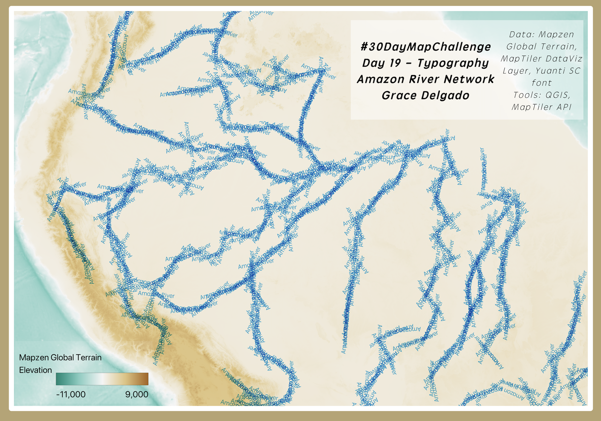
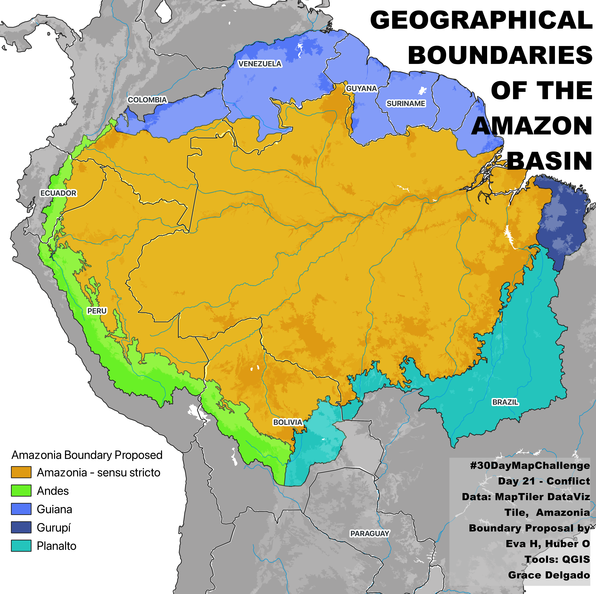

# 2024 30DayMapChallenge

This is a personal project for the 2024 #30DayMapChallenge, a daily social mapping project open to everyone and organized by [Topi Tjukanov](https://tjukanov.org/aboutme). The challenge takes place every November, with 30 different mapping themes - one for each day of the month. My personal goal was to create at least 10 maps and learn about new datasets and mapping tools along the way.

Below are my entries for the 2024 [30 Day Map Challenge](https://30daymapchallenge.com/) for the daily themes shown below.

   

## 1 - Points

For Day 1’s Points theme, I mapped independent high schools across Massachusetts using geopandas and folium in Google Colab. The map includes pop-ups with school names and cities, highlighting a concentration of schools in eastern MA—likely reflecting population density.

Data: AISNE school list, MassGIS

Tools: Python (GeoPandas, Folium), Google Colab

[1-points_massachusetts_schools_map.html](1-points_massachusetts_schools_map.html)
https://github.com/Hummingrace/30daymapchallenge/blob/dc6b620d4495d462ba3527639e159a2b31e9be65/1-points_massachusetts_schools_map.html)

 

## 2 - Lines

For Day 2’s Lines theme, I mapped all 911 Dunkin' Donuts locations in Massachusetts, drawing nearest-neighbor lines to visualize store density and proximity. Data was scraped and geocoded using the Google Maps API and Python libraries in Google Colab.

Data: Dunkin’ store locations (scraped), Google Maps API

Tools: Python (Folium and GeoPandas-visualizing geospatial data, Selenium-web scraping, SciPy-mapping nearest neighbors), Google Colab

[2-lines_massachusetts_dunkin_donut_locations_map.html](2-lines_massachusetts_dunkin_donut_locations_map.html)
https://github.com/Hummingrace/30daymapchallenge/blob/dc6b620d4495d462ba3527639e159a2b31e9be65/2-lines_massachusetts_dunkin_donut_locations_map.html

 

## 3 - Polygons

For Day 3’s Polygons theme, I made a poster-style map of the Town of Concord using OSM building polygons, roads, and route lines to highlight the town’s layout. Inspired by Walter L. Molina P.’s Day 2 map of Caracas, I followed a tutorial and picked up new QGIS and QuickOSM skills for future projects.

Data: OpenStreetMap via QuickOSM

Tools: QGIS, QGIS Print Layout

Inspiration: Walter L. Molina P. (Day 2: Lines) + Open Source for Architects tutorial

 

## 5 - A journey

For Day 5’s Journey theme, I mapped a 2019 road trip through Ecuador, combining personal photos with a route across volcanoes, crater lakes, hot springs, and the Amazon. This was a dream trip full of breathtaking views, Andean towns, and roadside fruit stands.

Data: DEM from OpenTopography, shapefiles from HDX, personal photos

Tools: QGIS

 

## 6 - Raster

For Day 6’s Raster theme, I created an artistic DEM and hillshade rendering of the Galapagos Islands using vivid, sci-fi-inspired colors to highlight the islands’ volcanic terrain. 

Data: OpenTopography DEM, Google Satellite Imagery

Tools: QGIS

 

## 7 - Vintage style

For Day 7’s Vintage theme, I recreated a modernized version of the 1902 USGS Framingham topographic map, using DEM gradient styling and hillshade to achieve a vintage look. I added Concord’s current roads, rail line, and buildings over a CartoLight base, with 20-foot contours for relief.

Data: ESRI's Living Atlas, DEM, QuickOSM (roads, rail, buildings), USGS map reference, MapTiler CartoLight basemap

Tools: QGIS

 

## 9 - AI only

For Day 9’s AI Only theme, I used DALL·E to generate a topographic map of Massachusetts with standard cartographic elements. While the general shape and elevation features were surprisingly accurate, the map included misplaced labels, odd insets (Florida as Cape Cod!), illegible text, and two north arrows—highlighting both the potential and limits of AI-generated maps.

Tool: DALL·E (OpenAI)

Prompt: Topographic map of Massachusetts styled like ArcGIS Pro with full map elements

 

## 10 - Pen & Paper

For Day 10’s Pen & Paper theme, I hand-drew a map of Casco Viejo, Panama City, inspired by the vibrant patterns of traditional mola art. A colorful, doodle-style tribute to the historic district’s charm.

Tools: Pen & paper

Inspiration: Mola-style art from Panama

 

## 13 - A new tool

For Day 13’s New Tool theme, I explored Landsat Explorer to map the Quelccaya Ice Cap in Peru. In just ~15 minutes, I created:

1) A 40-year ice extent change map using MNDWI from June 1984 and 2024 scenes.

2) A temperature time series showing seasonal cooling trends.

Data & Tools: USGS Landsat Explorer https://lnkd.in/eTMn5GgX

 

## 15 - My Data

For Day 15’s My Data theme, I mapped my childhood school bus route from Cuenca to the parish of Ricaurte—a ~30-minute ride that marked my early years before moving to the U.S.

Data: OSM Roads via QuickOSM, custom background using MapTiler Toner basemap, route calculated with QGIS Shortest Path tool.

Tools: QGIS, MapTiler

 

## 19 - Typology

For Day 19’s Typography theme, I created a map of the Amazon River Network where river paths are visualized using repeating text instead of lines. Typography was styled in QGIS using the Font Marker option under the Symbology settings.

Data: MapTiler API, Mapzen Global Terrain

Tools: QGIS

 

## 21 - Conflict

For Day 21’s theme of Conflict, I mapped the extent of Amazonia using geographic subregions defined by the European Commission JRC and ACTO to reflect ecological and hydrological boundaries. The visualization highlights how stewardship of the Amazon is shared across eight South American nations, with Brazil holding the largest share.

Data: ACTO/JRC Amazonia extent dataset https://lnkd.in/eiViQXVX

Publication: JRC Report on Amazonia https://lnkd.in/eBmCbX2h

Tools: QGIS

 

## 22 - 2 Colors

For Day 22's 2 colors theme I decided on a high contrast map of Boston's natural spaces in green against blues tones for all buildings, while framing them in by roads and highways in black (which is apparently not a color according to color theory). 

Data: OSM buildings, natural, roads, MapTiler Toner baselayer

Tools: QGIS, MapTiler API, QuickOSM plugin

 
