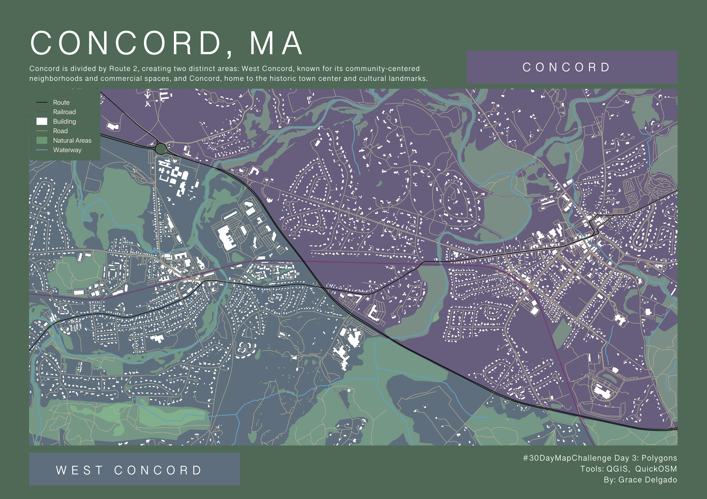
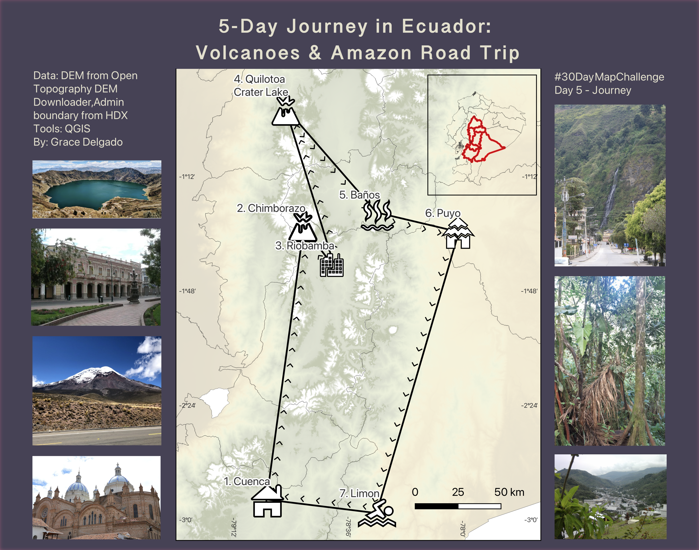
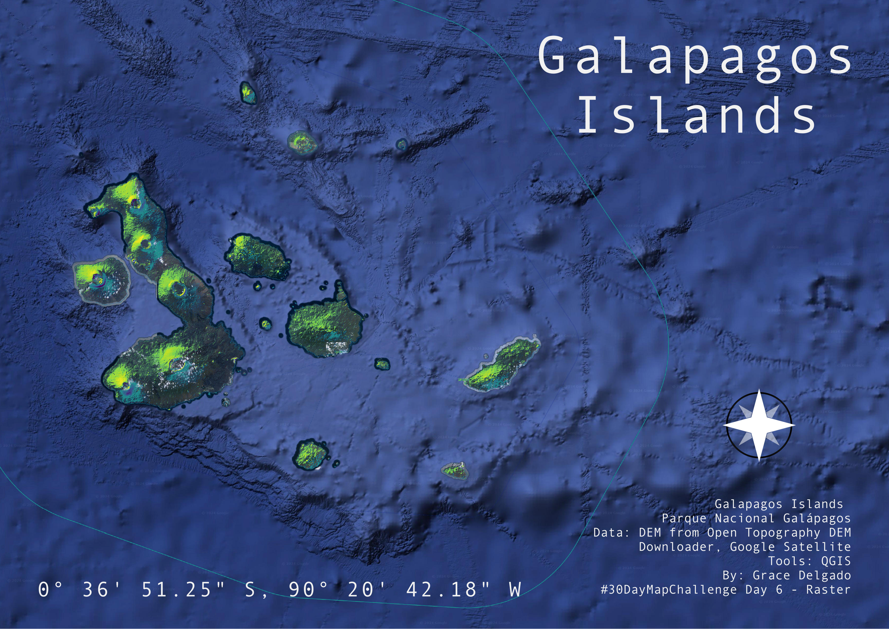
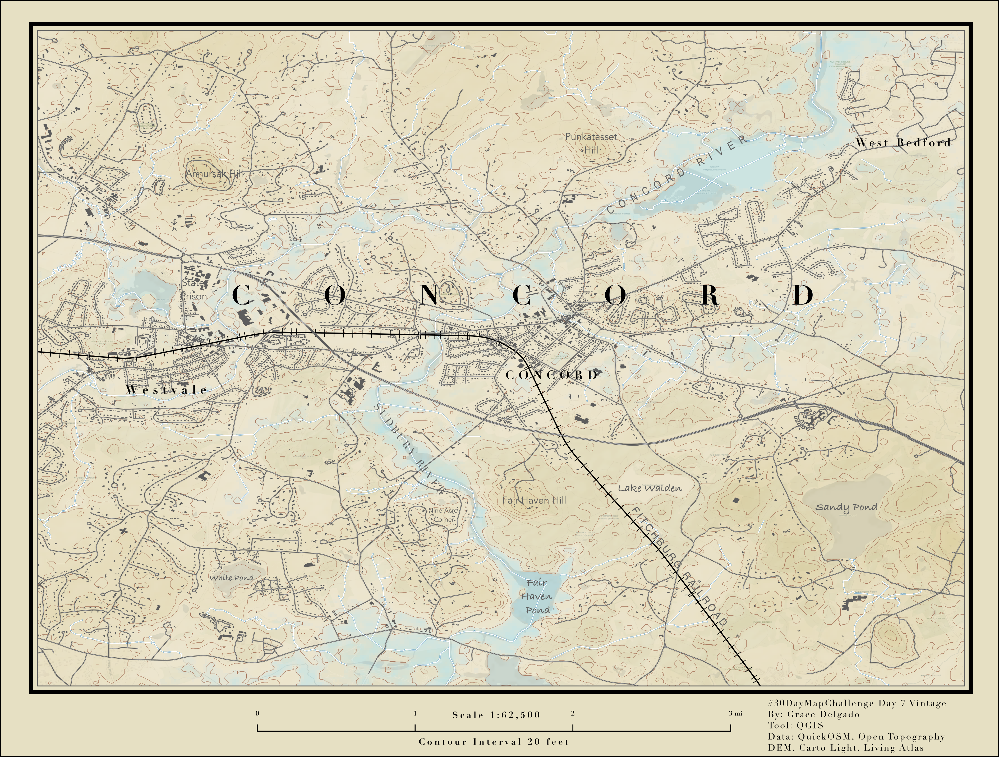
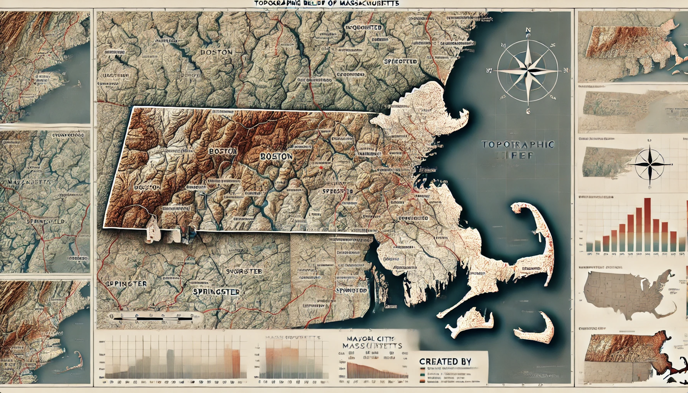
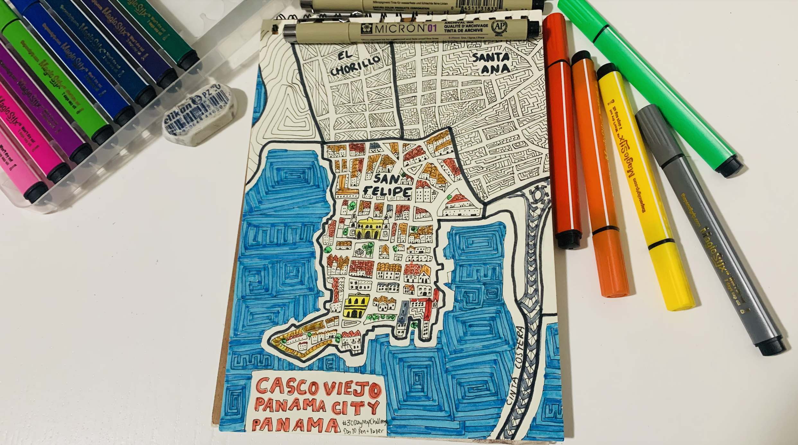
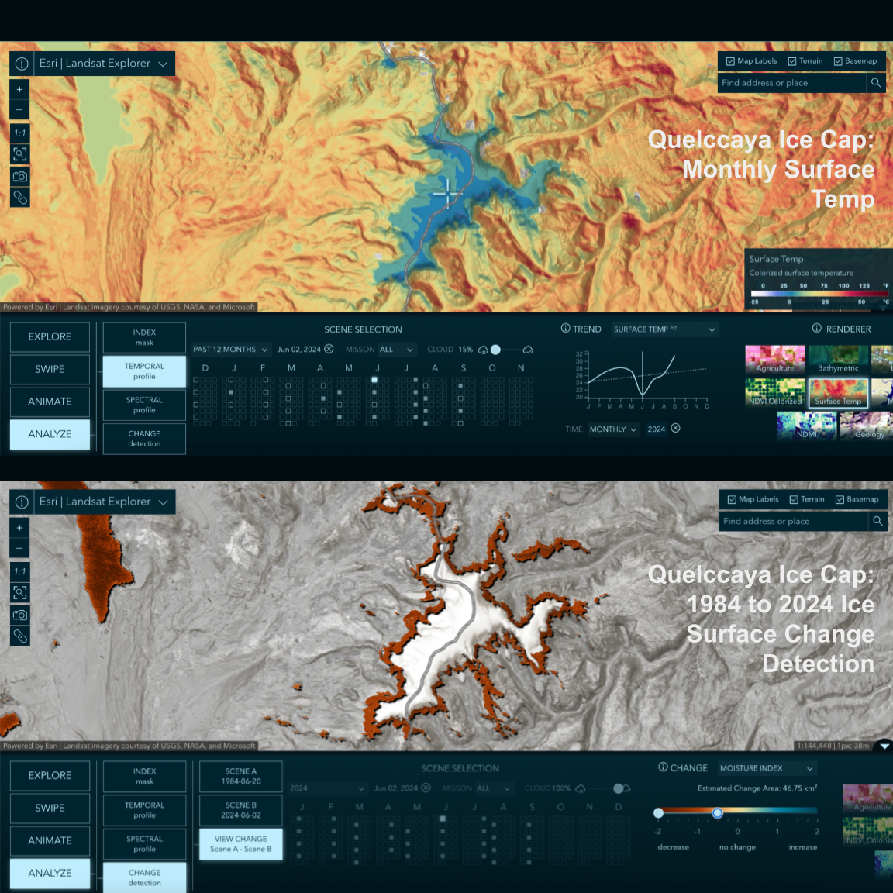
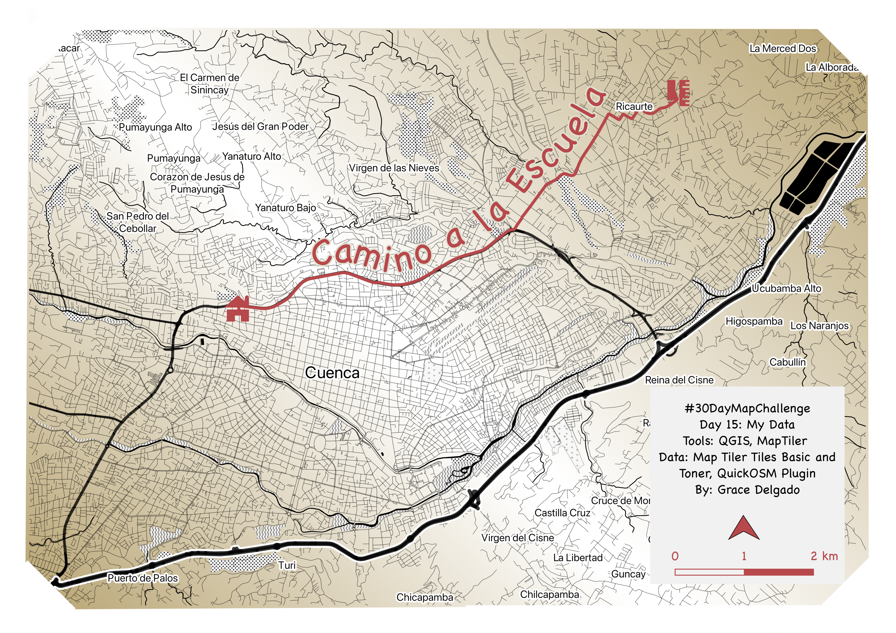
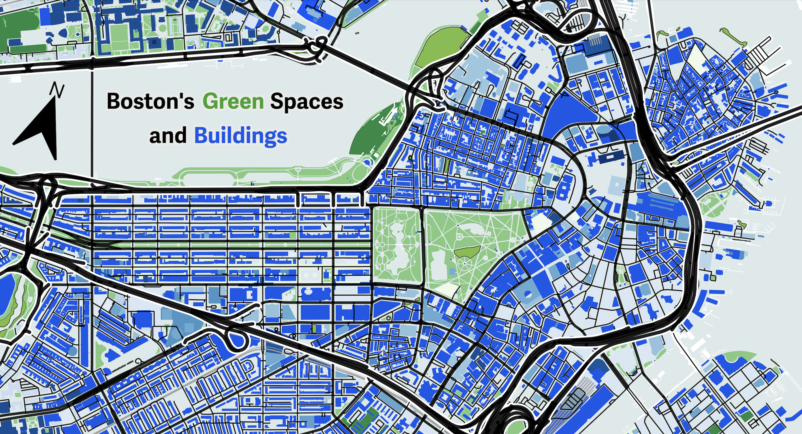

# 2024 30DayMapChallenge

My entries for the 2024 [30 Day Map Challenge](https://30daymapchallenge.com/) organized by [Topi Tjukanov](https://tjukanov.org/aboutme).

This is a daily social mapping project happening every November.

   

## 1 - Points
[1-points_massachusetts_schools_map.html](https://github.com/Hummingrace/30daymapchallenge/blob/dc6b620d4495d462ba3527639e159a2b31e9be65/1-points_massachusetts_schools_map.html)

 

## 2 - Lines
[2-lines_massachusetts_dunkin_donut_locations_map.html](https://github.com/Hummingrace/30daymapchallenge/blob/dc6b620d4495d462ba3527639e159a2b31e9be65/2-lines_massachusetts_dunkin_donut_locations_map.html)

 

## 3 - Polygons

 

## 5 - A journey

 

## 6 - Raster

 

## 7 - Vintage style

 

## 9 - AI only

 

## 10 - Pen & Paper

 

## 13 - A new tool

 

## 15 - My Data

 

## 22 - 2 Colors

I decided on a high contrast map of Boston's green spaces and natural areas in green against blues tones for all buildings, while framing them in by roads and highways in black (which is apparently not a color according to color theory). 

Data: OSM buildings, natural, roads, MapTiler Toner baselayer

Tools: QGIS, MapTiler API, QuickOSM plugin

 
